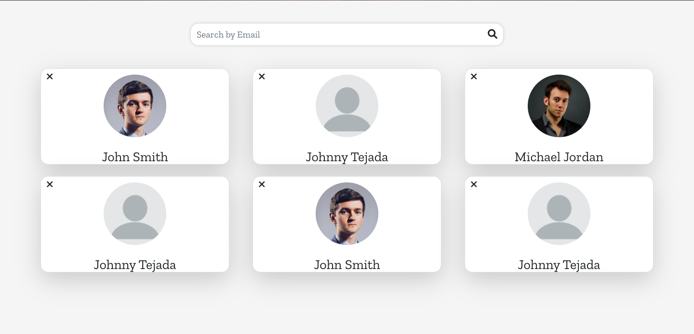

# Description of Web Application

Vacay is a social media application that highlights users' travel experiences. Users are allowed to create an account, add adventures and posts to their account, and view other people's travel experiences. Users are also able to comment on their friends' pages. Unlike Instagram and Facebook, users do not have the capability to like or share other people's posts/adventures. It is intended to only view and display one's own experience without judgement. Users will be able to view other people's pages through the input of the other person's email. This allows users' account to be private rather than public. The application is finished however, there are some features that can be added later. For example, the ability for a user to change the background image in their Home, History and Friends page can be added implemented in the future. Also, for the flight information, I plan on implementing the process bar to progress throughout time. Thus, it can indicate if the user has arrived to their destination or if the flight was delayed.

---

# Bugs / Issues

Currently, when a user adds a stop that they plan to visit in each adventure, the stop is displayed twice - one on top of the other. This view does not change to its regular view and size until three locations have been added.

---

# Technologies used

### Front End:

- React
- Bootstrap
- HTML/CSS
- JavaScript
- Font Awesome

### Back End

- Node JS
- Express
- MySQL

---

# Enhanced Relational Diagram


#### Business Rules:

A USER may create any number of ADVENTUREs. However, each ADVENTURE must be created by exactly one USER.

A USER may obtain any number of FRIENDs. However, each FRIEND must belong to exactly one USER.

A USER may create any number of COMMENTs. However, each COMMENT must be created by exactly one USER.

An ADVENTURE may obtain any number of POSTs. However, each POST must be obtained by exactly one ADVENTURE.

An ADVENTURE may obtain any number of COMMENTs. However, each COMMENT must be obtained by exactly one ADVENTURE.

An ADVENTURE may obtain any number of FLIGHTs. However, each FLIGHT must be obtained by exactly one ADVENTURE.

An ADVENTURE may obtain any number of STOPs. However, each STOP must be obtained by exactly one ADVENTURE.

A STOP may obtain any number of AGENDAs. However, each AGENDA must be obtained by exactly one STOP.

---

# Procedure for downloading application

After cloning Git repository, run command:

`npm i`

to add all dependencies needed for the client side. Then:

```
cd server
npm i
```

to add all dependencies needed for the server side.

### Available Scripts

**_This project was bootstrapped with [Create React App](https://github.com/facebook/create-react-app)._**

In the project directory, you can run:

`npm start`

Runs the app in the development mode.\
Open [http://localhost:3000](http://localhost:3000) to view it in your browser.

The page will reload when you make changes.\
You may also see any lint errors in the console.

`npm run dev`

Runs the server of the application.

### Database Set Up

Declare your environmental variables in a .env file.
You need to declare the following:

- Database Host
- Database User
- Database Password
- Database Name

---

# Application Screenshots





